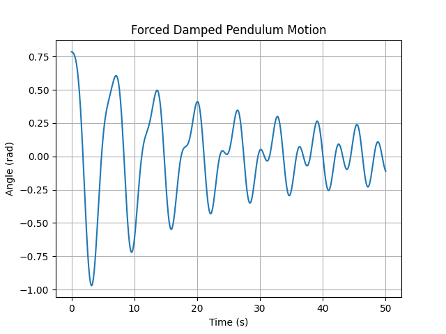
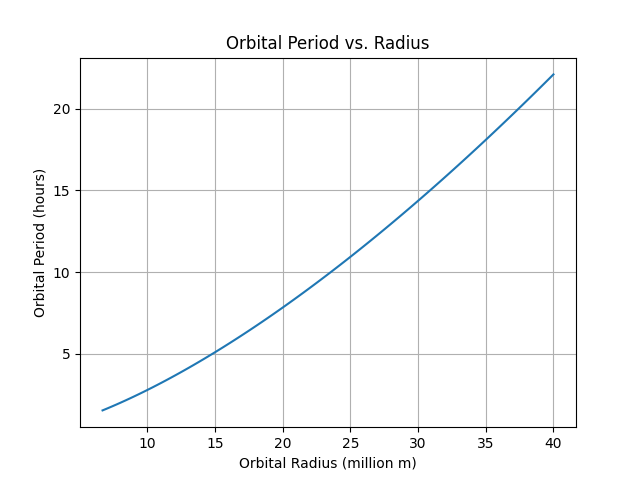

# Investigating the Range as a Function of the Angle of Projection

## Motivation

Projectile motion is a fundamental concept in physics, illustrating how objects move under gravity. This study explores how the range of a projectile depends on its launch angle, uncovering both theoretical and computational insights.

## Theoretical Foundation

The motion of a projectile follows these kinematic equations:

- Horizontal motion: 
             
    $x = v_0 \cos(\theta) t$


- Vertical motion: 

    $y = v_0 \sin(\theta) t - \frac{1}{2} g t^2$


- Time of flight: 

     $T = \frac{2 v_0 \sin(\theta)}{g}$


- Range equation:


    $R = \frac{v_0^2 \sin(2\theta)}{g}$


### Python Simulation

```python
import numpy as np
import matplotlib.pyplot as plt

g = 9.81  # gravitational acceleration (m/s^2)
v0 = 20   # initial velocity (m/s)
theta = np.linspace(0, np.pi/2, 100)
R = (v0**2 * np.sin(2*theta)) / g

plt.plot(np.degrees(theta), R)
plt.xlabel("Launch Angle (degrees)")
plt.ylabel("Range (m)")
plt.title("Projectile Range vs. Launch Angle")
plt.grid()
plt.show()
```

---

## Investigating the Dynamics of a Forced Damped Pendulum

### Motivation

The forced damped pendulum exhibits complex behaviors such as resonance and chaos. Understanding its motion helps in various applications, from engineering to climate models.

### Theoretical Foundation

The equation of motion for a forced damped pendulum is:

  
$\frac{d^2\theta}{dt^2} + b\frac{d\theta}{dt} + \omega_0^2 \sin\theta = A \cos(\omega t)$


### Python Simulation

```python
from scipy.integrate import solve_ivp

def pendulum(t, y, b, w0, A, w):
    theta, omega = y
    return [omega, -b*omega - w0**2*np.sin(theta) + A*np.cos(w*t)]

b, w0, A, w = 0.1, 1.0, 0.5, 2.0
t = np.linspace(0, 50, 1000)
sol = solve_ivp(pendulum, [0, 50], [np.pi/4, 0], args=(b, w0, A, w), t_eval=t)

plt.plot(t, sol.y[0])
plt.xlabel("Time (s)")
plt.ylabel("Angle (rad)")
plt.title("Forced Damped Pendulum Motion")
plt.grid()
plt.show()
```

---

## Orbital Period and Orbital Radius

### Motivation

Kepler's Third Law states that the square of the orbital period is proportional to the cube of the orbital radius. This principle is key in astrophysics and satellite design.

### Theoretical Foundation

For circular orbits:

$T^2 = \frac{4\pi^2 r^3}{GM}$


### Python Simulation

```python
G = 6.674e-11  # Gravitational constant (m^3/kg/s^2)
M = 5.972e24   # Earth mass (kg)
r = np.linspace(6.7e6, 4e7, 100)  # Orbital radius range (m)
T = 2 * np.pi * np.sqrt(r**3 / (G * M))

plt.plot(r / 1e6, T / 3600)
plt.xlabel("Orbital Radius (million m)")
plt.ylabel("Orbital Period (hours)")
plt.title("Orbital Period vs. Radius")
plt.grid()
plt.show()
```

---

### Conclusion

These simulations provide insights into projectile motion, pendulums, and orbits, demonstrating their dependence on key parameters. Further refinements could include air resistance and non-linear effects to enhance realism.

