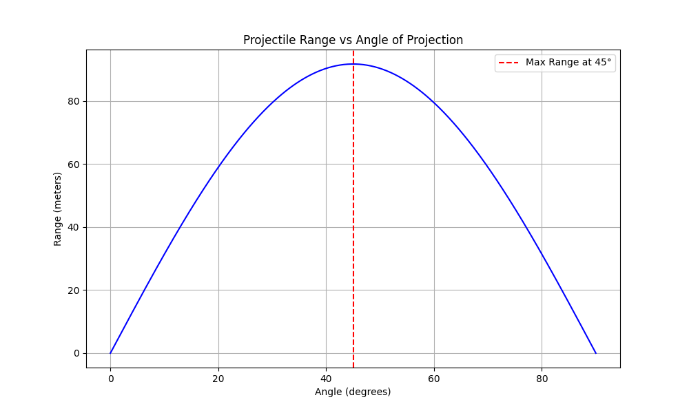

# Investigating the Range as a Function of the Angle of Projection

## Motivation

Projectile motion, while seemingly simple, offers a rich playground for exploring fundamental principles of physics. The goal is to analyze how the **range** of a projectile depends on its **angle of projection**. Despite its simplicity, this system unveils deep physical insights through linear and quadratic relationships.

Parameters like **initial velocity**, **gravitational acceleration**, and **launch height** influence the trajectory, allowing us to model diverse real-world phenomena—from sports to rocketry.

---

## 1. Theoretical Foundation

### Equations of Motion

We consider a projectile launched from ground level (height = 0) with:
- Initial velocity $( v_0 )$
- Angle of projection $( \theta )$
- Gravitational acceleration $( g )$

The horizontal and vertical components of velocity:

$$
v_{x} = v_0 \cos(\theta), \quad v_{y} = v_0 \sin(\theta)
$$

Time of flight (until the projectile returns to $y$ = 0):

$$
T = \frac{2v_0 \sin(\theta)}{g}
$$

Horizontal Range:

$$
R(\theta) = v_{x} \cdot T = \frac{v_0^2 \sin(2\theta)}{g}
$$

This equation reveals a **sinusoidal dependence** of range on $ 2\theta $. The **maximum range** occurs when $ \theta = 45^\circ $.

---

## 2. Analysis of the Range vs Angle

### Python Code: Plotting the Range as a Function of Angle

```python
import numpy as np
import matplotlib.pyplot as plt

# Parameters
v0 = 30  # initial velocity in m/s
g = 9.81  # gravitational acceleration in m/s²

# Angles from 0 to 90 degrees
angles_deg = np.linspace(0, 90, 500)
angles_rad = np.radians(angles_deg)

# Range formula: R = (v0^2 * sin(2θ)) / g
ranges = (v0**2 * np.sin(2 * angles_rad)) / g

# Plotting
plt.figure(figsize=(10, 6))
plt.plot(angles_deg, ranges, color='blue')
plt.title("Projectile Range vs Angle of Projection")
plt.xlabel("Angle (degrees)")
plt.ylabel("Range (meters)")
plt.grid(True)
plt.axvline(45, color='red', linestyle='--', label='Max Range at 45°')
plt.legend()
plt.show()
](../../_pics/Mecaplot1.png)