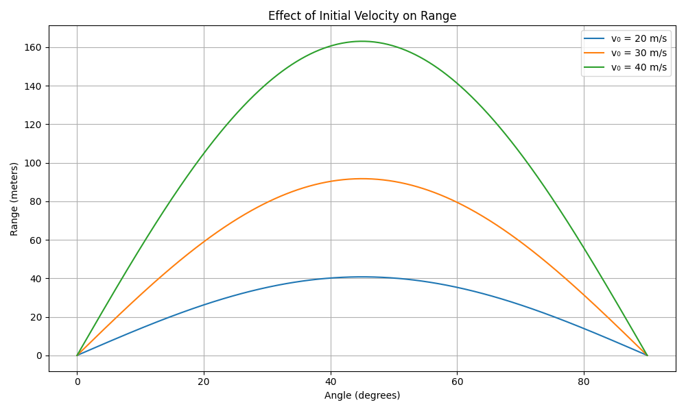

# Investigating the Range as a Function of the Angle of Projection

## Motivation

Projectile motion, while seemingly simple, offers a rich playground for exploring fundamental principles of physics. The goal is to analyze how the **range** of a projectile depends on its **angle of projection**. Despite its simplicity, this system unveils deep physical insights through linear and quadratic relationships.

Parameters like **initial velocity**, **gravitational acceleration**, and **launch height** influence the trajectory, allowing us to model diverse real-world phenomena—from sports to rocketry.

---

## 1. Theoretical Foundation

### Equations of Motion

We consider a projectile launched from ground level (height = 0) with:
- Initial velocity $( v_0 )$
- Angle of projection $( \theta )$
- Gravitational acceleration $( g )$

The horizontal and vertical components of velocity:

$$
v_{x} = v_0 \cos(\theta), \quad v_{y} = v_0 \sin(\theta)
$$

Time of flight (until the projectile returns to $y$ = 0):

$$
T = \frac{2v_0 \sin(\theta)}{g}
$$

Horizontal Range:

$$
R(\theta) = v_{x} \cdot T = \frac{v_0^2 \sin(2\theta)}{g}
$$

This equation reveals a **sinusoidal dependence** of range on $ 2\theta $. The **maximum range** occurs when $ \theta = 45^\circ $.

---

## 2. Analysis of the Range vs Angle

### Python Code: Plotting the Range as a Function of Angle

```python
import numpy as np
import matplotlib.pyplot as plt

# Parameters
v0 = 30  # initial velocity in m/s
g = 9.81  # gravitational acceleration in m/s²

# Angles from 0 to 90 degrees
angles_deg = np.linspace(0, 90, 500)
angles_rad = np.radians(angles_deg)

# Range formula: R = (v0^2 * sin(2θ)) / g
ranges = (v0**2 * np.sin(2 * angles_rad)) / g

# Plotting
plt.figure(figsize=(10, 6))
plt.plot(angles_deg, ranges, color='blue')
plt.title("Projectile Range vs Angle of Projection")
plt.xlabel("Angle (degrees)")
plt.ylabel("Range (meters)")
plt.grid(True)
plt.axvline(45, color='red', linestyle='--', label='Max Range at 45°')
plt.legend()
plt.show()

```


</details>

### Observations:
* The range reaches its maximum at 45°.

* Complementary angles (e.g., 30° and 60°) yield the same range.

* The curve is symmetric around 45°.

## 3. Influence of Parameters

And with appying modifications on $ v_0 $  $g$ 
this is how can affect the plot 

<details>
<summary>Python Code</summary>

```python
import numpy as np
import matplotlib.pyplot as plt

# Common parameters
angles_deg = np.linspace(0, 90, 500)
angles_rad = np.radians(angles_deg)

# ========== Effect of Initial Velocity ==========
v0_values = [20, 30, 40]  # initial velocities in m/s
g = 9.81  # gravitational acceleration (Earth)

plt.figure(figsize=(10, 6))
for v0 in v0_values:
    ranges = (v0**2 * np.sin(2 * angles_rad)) / g
    plt.plot(angles_deg, ranges, label=f'v₀ = {v0} m/s')

plt.title("Effect of Initial Velocity on Range")
plt.xlabel("Angle (degrees)")
plt.ylabel("Range (meters)")
plt.grid(True)
plt.legend()
plt.tight_layout()
plt.show()

# ========== Effect of Gravity ==========
g_values = [9.81, 1.62]  # Earth and Moon gravity
v0_fixed = 30  # fixed initial velocity

plt.figure(figsize=(10, 6))
for g in g_values:
    ranges = (v0_fixed**2 * np.sin(2 * angles_rad)) / g
    label = f'g = {g} m/s² ({"Earth" if g==9.81 else "Moon"})'
    plt.plot(angles_deg, ranges, label=label)

plt.title("Effect of Gravity on Range")
plt.xlabel("Angle (degrees)")
plt.ylabel("Range (meters)")
plt.grid(True)
plt.legend()
plt.tight_layout()
plt.show()
```
</details>




**Key Takeaways:**

Higher velocity = longer range.

Lower gravity (e.g., Moon) = much longer range.

## 4. Practical Applications

Real-World Adjustments

Uneven terrain affects landing point `→` adjust final height.

Air resistance shortens range `→` not covered in ideal model.

Wind adds horizontal forces `→` requires differential equations.

### Example: Adding a Launch Height
<details>
<summary>Python Code</summary>
---
```python

def range_with_height(v0, theta_deg, h, g=9.81):
    theta = np.radians(theta_deg)
    vx = v0 * np.cos(theta)
    vy = v0 * np.sin(theta)
    t_flight = (vy + np.sqrt(vy**2 + 2 * g * h)) / g
    return vx * t_flight

h = 10  # 10 meters launch height
ranges = [range_with_height(30, angle, h) for angle in angles_deg]

plt.figure(figsize=(10, 6))
plt.plot(angles_deg, ranges)
plt.title("Range vs Angle (with Launch Height h = 10 m)")
plt.xlabel("Angle (degrees)")
plt.ylabel("Range (meters)")
plt.grid(True)
plt.show()

</details>

--- 

Insights:
Maximum range shifts to lower than 45° if starting from a height.

Launch height increases overall range.

## 5. Limitations of the Idealized Model


|Assumption        | Real-World Factor             | Impact                     |
|------------------|-------------------------------|----------------------------|
|No air resistance | Drag force	                   |Reduces range               |
|Constant gravity  | Varies with altitude          |Small effect in most cases  |
|Flat terrain      |	Hills or valleys           |Changes point of impact     |
|No wind           | Wind can push/pull projectile | Alters horizontal motion   |


**Suggestions for Improvement**


* Use `scipy.integrate.solve_ivp` to include air drag.

* Use parametric terrain modeling for variable height.

* Apply wind forces using vector additions in numerical simulation.

## Conclusion
Projectile range depends heavily on angle, initial speed, and gravitational field. The theoretical model, while idealized, provides great insight and a foundation for more complex simulations. With simple Python tools, we can visualize and analyze this behavior effectively—bridging the gap between theory and practice.

