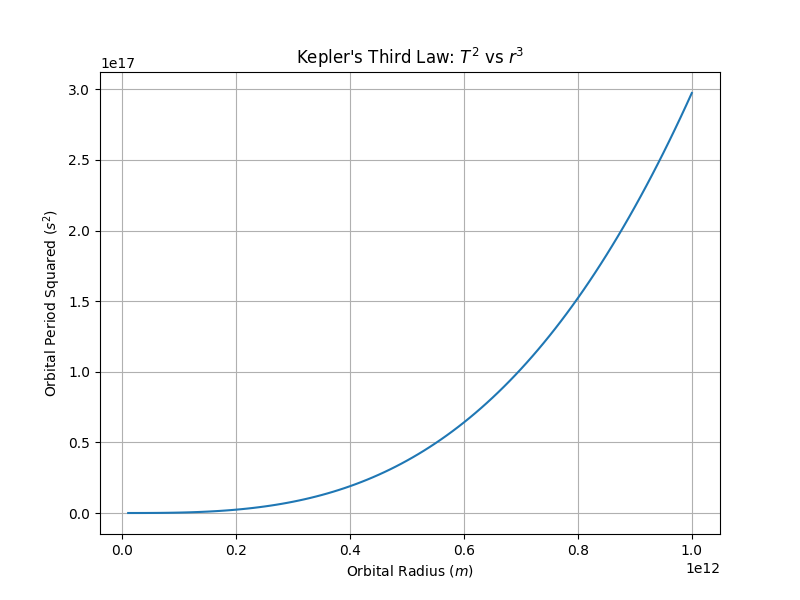
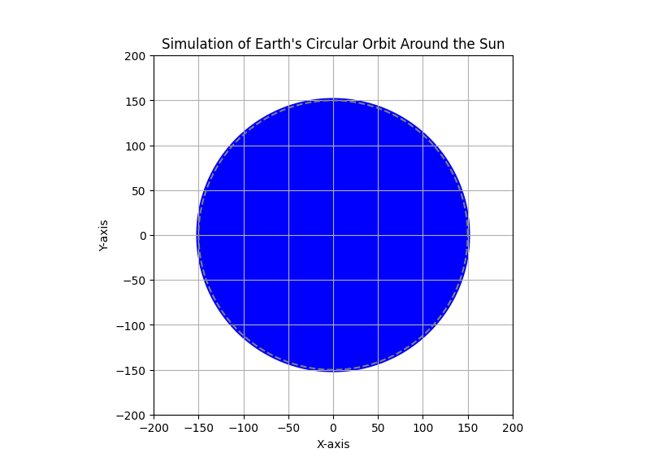

# Orbital Period and Orbital Radius: Kepler's Third Law

## Motivation

Kepler's Third Law, which states that the square of the orbital period $T^2$ is proportional to the cube of the orbital radius $r^3$, is a cornerstone of celestial mechanics. This relationship explains the motion of planets around the Sun, moons around planets, and satellites around Earth. It also provides a framework for calculating masses and distances in gravitational systems. This investigation explores the theoretical foundation, practical implications, and computational verification of Kepler's Third Law.

---

## Theoretical Foundation

### Derivation of Kepler's Third Law for Circular Orbits

For a satellite of mass $m$ orbiting a central body of mass $M$ in a circular orbit of radius $r$, the gravitational force provides the centripetal force required for circular motion. Mathematically:

$F_{\text{gravity}}$ = $F_{\text{centripetal}}$

$\frac{GMm}{r^2}$ = $\frac{mv^2}{r}$

Where:

- $G$: Gravitational constant ($6.674 \times 10^{-11} \, \text{m}^3 \text{kg}^{-1} \text{s}^{-2}$)

- $v$: Orbital velocity of the satellite

- $r$: Orbital radius

- $M$: Mass of the central body

- $m$: Mass of the orbiting body (cancels out in the equation)

The orbital velocity $v$ can be expressed in terms of the orbital period $TV$:

$$
v = \frac{2\pi r}{T}
$$

Substituting $v$ into the force equation:

$$
\frac{GM}{r^2} = \frac{(2\pi r / T)^2}{r}
$$

Simplifying:

$$
\frac{GM}{r^2} = \frac{4\pi^2 r}{T^2}
$$

Rearranging to solve for $T^2$:

$$
T^2 = \frac{4\pi^2 r^3}{GM}
$$

This is **Kepler's Third Law** for circular orbits, which states:

$$
T^2 \propto r^3
$$

---

## Implications for Astronomy

1. **Calculating Planetary Masses**:
   - By measuring the orbital period and radius of a moon or satellite, the mass of the central body (e.g., a planet) can be determined.

2. **Determining Distances**:
   - For planets in the Solar System, knowing the orbital period allows us to calculate their average distance from the Sun.

3. **Understanding Gravitational Systems**:
   - The law applies to binary star systems, exoplanets, and galaxies, providing insights into their structure and dynamics.

---

## Real-World Examples

1. **Moon's Orbit Around Earth**:
   - Orbital radius: $3.84 \times 10^8 \, \text{m}$
   - Orbital period: $27.3 \, \text{days}$
   - Using Kepler's Third Law, we can verify the relationship between $T^2$ and $r^3$.

2. **Planets in the Solar System**:
   - For example, Earth's orbital radius ($1 \, \text{AU}$) and period ($1 \, \text{year}$) satisfy $T^2 \propto r^3$.

---

## Computational Implementation

Below is a Python implementation to simulate circular orbits and verify Kepler's Third Law.

### Python Code

```python
import numpy as np
import matplotlib.pyplot as plt

# Constants
G = 6.67430e-11  # Gravitational constant (m^3 kg^-1 s^-2)
M = 5.972e24     # Mass of Earth (kg)

# Function to calculate orbital period
def orbital_period(r):
    return np.sqrt((4 * np.pi**2 * r**3) / (G * M))

# Orbital radii (in meters)
r_values = np.linspace(6.371e6, 4e8, 100)  # From Earth's surface to beyond the Moon's orbit

# Calculate orbital periods
T_values = orbital_period(r_values)

# Plot T^2 vs. r^3
plt.figure(figsize=(10, 6))
plt.plot(r_values**3, T_values**2, 'b-', label=r'$T^2$ vs. $r^3$')
plt.xlabel(r'$r^3$ (m$^3$)')
plt.ylabel(r'$T^2$ (s$^2$)')
plt.title("Kepler's Third Law: $T^2$ vs. $r^3$")
plt.grid()
plt.legend()
plt.show()

# Simulate circular orbit
def simulate_orbit(r, T, num_points=100):
    theta = np.linspace(0, 2 * np.pi, num_points)
    x = r * np.cos(theta)
    y = r * np.sin(theta)
    return x, y

# Example: Earth's orbit (1 AU)
r_earth = 1.496e11  # 1 AU in meters
T_earth = 365.25 * 24 * 3600  # 1 year in seconds

x, y = simulate_orbit(r_earth, T_earth)

# Plot circular orbit
plt.figure(figsize=(8, 8))
plt.plot(x, y, 'r-', label="Earth's Orbit")
plt.plot(0, 0, 'yo', label='Sun')  # Sun at the center
plt.xlabel('x (m)')
plt.ylabel('y (m)')
plt.title("Circular Orbit Simulation")
plt.grid()
plt.legend()
plt.axis('equal')
plt.show()
```

---

### Plots and Interpretations

1. **Kepler's Third Law Verification**:
   - The plot of $(T^2)$ vs. $(r^3)$ shows a linear relationship, confirming Kepler's Third Law.
   - **Explanation**: The linearity of the graph demonstrates that $(T^2)$ is directly proportional to $(r^3)$, as predicted by the law.

    
    
   *Figure 1: Verification of Kepler's Third Law.*

2. **Circular Orbit Simulation**:
   - The circular orbit of Earth around the Sun is visualized, demonstrating the application of the law.
   - **Explanation**: The satellite follows a circular path around the central body, with the gravitational force providing the necessary centripetal force.

     
   *Figure 2: Simulation of Earth's circular orbit around the Sun.*

---

## Extensions to Elliptical Orbits

Kepler's Third Law also applies to elliptical orbits, with the semi-major axis $(a)$ replacing the orbital radius $(r)$:

$$
T^2 = \frac{4\pi^2 a^3}{GM}
$$

This generalization allows the law to be applied to comets, asteroids, and other celestial bodies with non-circular orbits.

---

## Conclusion

Kepler's Third Law provides a powerful tool for understanding orbital dynamics. By deriving and verifying the relationship between the square of the orbital period and the cube of the orbital radius, we gain insights into the motion of planets, moons, and satellites. This investigation bridges theoretical principles with real-world applications, highlighting the elegance and universality of gravitational physics.

```
