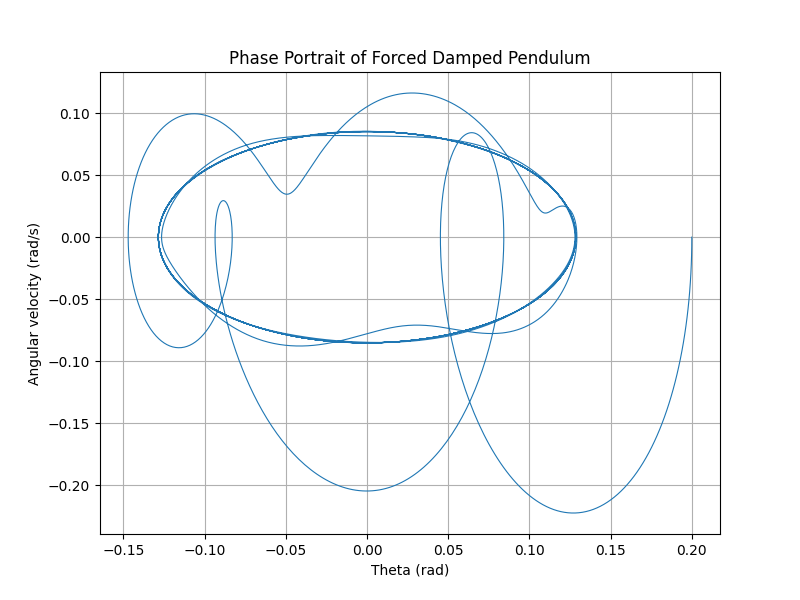
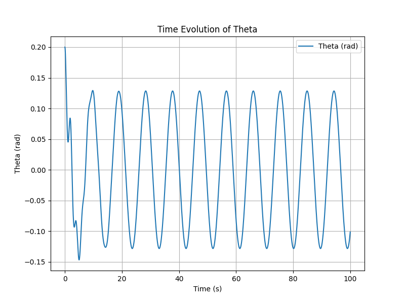
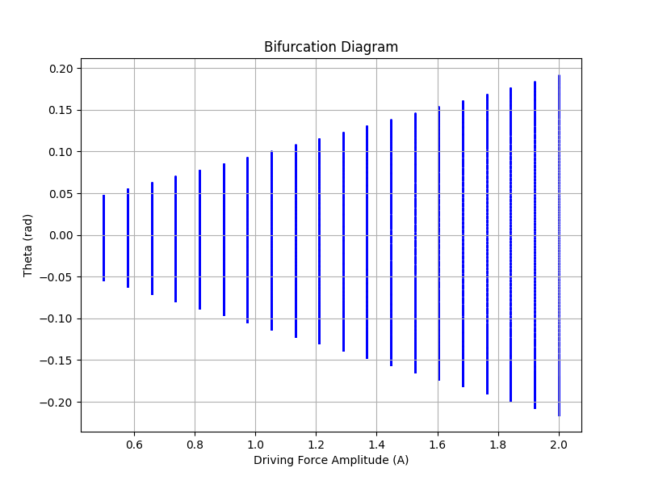

# Investigating the Dynamics of a Forced Damped Pendulum

## Introduction
The forced damped pendulum is an example of a system exhibiting complex behavior due to the interplay of damping, restoring forces, and external periodic driving forces. This simulation explores resonance, chaos, and quasiperiodic motion through numerical integration.

## Mathematical Model
The motion of the forced damped pendulum is governed by the equation:

$\ddot{\theta} + b \dot{\theta} + \frac{g}{L} \sin(\theta) = A \cos(\omega t)$

where:

- $b$ is the damping coefficient,

- $g$ is the acceleration due to gravity,

- $L$ is the length of the pendulum,

- $A$ is the amplitude of the driving force,

- $\omega$ is the driving frequency.

## Python Implementation
```python
import numpy as np
import matplotlib.pyplot as plt
from scipy.integrate import solve_ivp

# Parameters
g = 9.81   # Gravity (m/s^2)
L = 1.0    # Length of pendulum (m)
b = 0.5    # Damping coefficient
A = 1.2    # Driving force amplitude
omega = 2/3  # Driving frequency

# Differential equation
def forced_damped_pendulum(t, y):
    theta, omega_t = y
    dydt = [
        omega_t,
        -b * omega_t - (g/L) * np.sin(theta) + A * np.cos(omega * t)
    ]
    return dydt

# Time span
t_span = (0, 100)
t_eval = np.linspace(*t_span, 10000)

# Initial conditions
y0 = [0.2, 0]  # Initial angle and velocity

# Solve ODE
sol = solve_ivp(forced_damped_pendulum, t_span, y0, t_eval=t_eval, method='RK45')

# Phase portrait
plt.figure(figsize=(8, 6))
plt.plot(sol.y[0], sol.y[1], lw=0.8)
plt.xlabel("Theta (rad)")
plt.ylabel("Angular velocity (rad/s)")
plt.title("Phase Portrait of Forced Damped Pendulum")
plt.grid()
plt.show()

# Poincare section (stroboscopic map)
poincare_times = np.arange(0, 100, 2*np.pi/omega)
poincare_points = []

for t_p in poincare_times:
    idx = (np.abs(sol.t - t_p)).argmin()
    poincare_points.append([sol.y[0][idx], sol.y[1][idx]])

poincare_points = np.array(poincare_points)

plt.figure(figsize=(8, 6))
plt.scatter(poincare_points[:, 0], poincare_points[:, 1], s=10, color='red')
plt.xlabel("Theta (rad)")
plt.ylabel("Angular velocity (rad/s)")
plt.title("Poincaré Section")
plt.grid()
plt.show()

# Time series plot
plt.figure(figsize=(8, 6))
plt.plot(sol.t, sol.y[0], label='Theta (rad)')
plt.xlabel("Time (s)")
plt.ylabel("Theta (rad)")
plt.title("Time Evolution of Theta")
plt.legend()
plt.grid()
plt.show()

# Bifurcation diagram
A_values = np.linspace(0.5, 2.0, 20)
th_values = []

for A in A_values:
    def system(t, y):
        return [y[1], -b * y[1] - (g/L) * np.sin(y[0]) + A * np.cos(omega * t)]
    sol = solve_ivp(system, t_span, y0, t_eval=t_eval, method='RK45')
    th_values.append(sol.y[0][-500:])

plt.figure(figsize=(8, 6))
for i, A in enumerate(A_values):
    plt.scatter([A] * len(th_values[i]), th_values[i], s=1, color='blue')
plt.xlabel("Driving Force Amplitude (A)")
plt.ylabel("Theta (rad)")
plt.title("Bifurcation Diagram")
plt.grid()
plt.show()
```

## Results
The simulation produces:
1. **Phase Portrait**: Displays how the system evolves in phase space.

2. **Poincaré Section**: A stroboscopic map showing discrete points at specific time intervals, revealing periodic or chaotic behavior.

3. **Time Series Plot**: Shows the evolution of the pendulum’s angle over time.

4. **Bifurcation Diagram**: Demonstrates the transition to chaos as the driving force amplitude increases.


## Conclusion
The forced damped pendulum demonstrates a range of behaviors from simple oscillations to chaos, depending on parameter values. This study helps in understanding nonlinear dynamics in real-world systems like mechanical oscillators and electrical circuits.

