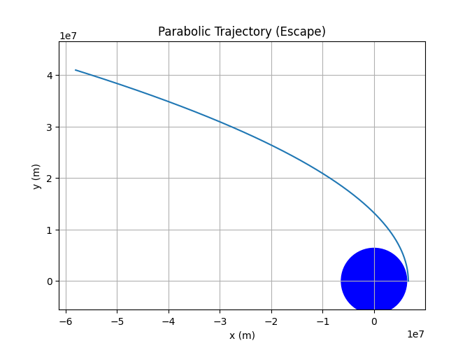

# Trajectories of a Freely Released Payload Near Earth

## Motivation

When an object is released from a moving rocket near Earth, its trajectory depends on initial conditions and gravitational forces. This scenario presents a rich problem, blending principles of orbital mechanics and numerical methods. Understanding the potential trajectories is vital for space missions, such as deploying payloads or returning objects to Earth.

## Task

Analyze the possible trajectories (e.g., parabolic, hyperbolic, elliptical) of a payload released near Earth. Perform a numerical analysis to compute the path of the payload based on given initial conditions (position, velocity, and altitude). Discuss how these trajectories relate to orbital insertion, reentry, or escape scenarios. Develop a computational tool to simulate and visualize the motion of the payload under Earth's gravity, accounting for initial velocities and directions.

## Theoretical Foundation

The motion of the payload is governed by Newton's Law of Universal Gravitation:

$$F = G \frac{M_E m}{r^2}$$


Where:

-   $F$ is the gravitational force

-   $G$ is the gravitational constant ($6.674 \times 10^{-11} \, \text{N m}^2/\text{kg}^2$)

-   $M_E$ is the mass of Earth ($5.972 \times 10^{24} \, \text{kg}$)

-   $m$ is the mass of the payload

-   $r$ is the distance between the payload and Earth's center


The acceleration of the payload is:

$$a = \frac{F}{m} = \frac{G M_E}{r^2}$$

We can use numerical integration (e.g., Euler's method, Runge-Kutta) to solve the equations of motion and determine the trajectory.

## Python Simulation

```python
import numpy as np
import matplotlib.pyplot as plt

# Constants
G = 6.674e-11
ME = 5.972e24
RE = 6.371e6  # Earth's radius

def gravity(r):
    return -G * ME / np.linalg.norm(r)**3 * r

def simulate_trajectory(r0, v0, dt, duration):
    num_steps = int(duration / dt)
    r = np.zeros((num_steps, 2))
    v = np.zeros((num_steps, 2))
    r[0] = r0
    v[0] = v0

    for i in range(1, num_steps):
        a = gravity(r[i-1])
        v[i] = v[i-1] + a * dt
        r[i] = r[i-1] + v[i] * dt
    return r

# Example 1: Elliptical Orbit
r0_ellipse = np.array([RE + 400e3, 0.0])
v0_ellipse = np.array([0.0, 7.5e3])
dt = 10
duration = 8000
r_ellipse = simulate_trajectory(r0_ellipse, v0_ellipse, dt, duration)

plt.figure(figsize=(8, 8))
plt.plot(r_ellipse[:, 0], r_ellipse[:, 1])
circle = plt.Circle((0, 0), RE, color='blue', fill=True)
plt.gca().add_artist(circle)
plt.xlabel("x (m)")
plt.ylabel("y (m)")
plt.title("Elliptical Orbit")
plt.axis('equal')
plt.grid(True)
plt.savefig('elliptical_orbit.png')
plt.show()

# Example 2: Escape Trajectory
r0_escape = np.array([RE + 200e3, 0.0])
v0_escape = np.array([0.0, 11.5e3])
r_escape = simulate_trajectory(r0_escape, v0_escape, dt, duration*3)

plt.figure(figsize=(8, 8))
plt.plot(r_escape[:, 0], r_escape[:, 1])
circle = plt.Circle((0, 0), RE, color='blue', fill=True)
plt.gca().add_artist(circle)
plt.xlabel("x (m)")
plt.ylabel("y (m)")
plt.title("Escape Trajectory")
plt.axis('equal')
plt.grid(True)
plt.savefig('escape_trajectory.png')
plt.show()

# Example 3: Re-entry Trajectory
r0_reentry = np.array([RE + 500e3, 0.0])
v0_reentry = np.array([0.0, -7.0e3])
r_reentry = simulate_trajectory(r0_reentry, v0_reentry, dt, duration)

plt.figure(figsize=(8, 8))
plt.plot(r_reentry[:, 0], r_reentry[:, 1])
circle = plt.Circle((0, 0), RE, color='blue', fill=True)
plt.gca().add_artist(circle)
plt.xlabel("x (m)")
plt.ylabel("y (m)")
plt.title("Re-entry Trajectory")
plt.axis('equal')
plt.grid(True)
plt.savefig('reentry_trajectory.png')
plt.show()

# Example 4: Parabolic Trajectory (Escape Velocity)
r0_parabolic = np.array([RE + 300e3, 0.0])
v0_parabolic = np.array([0.0, np.sqrt(2 * G * ME / (RE + 300e3))]) # escape velocity
r_parabolic = simulate_trajectory(r0_parabolic, v0_parabolic, dt, duration*2)

plt.figure(figsize=(8, 8))
plt.plot(r_parabolic[:, 0], r_parabolic[:, 1])
circle = plt.Circle((0, 0), RE, color='blue', fill=True)
plt.gca().add_artist(circle)
plt.xlabel("x (m)")
plt.ylabel("y (m)")
plt.title("Parabolic Trajectory (Escape)")
plt.axis('equal')
plt.grid(True)
plt.savefig('parabolic_trajectory.png')
plt.show()

```


