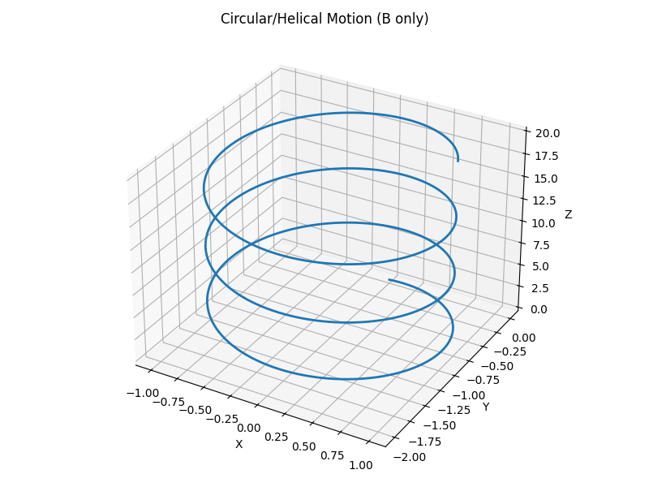
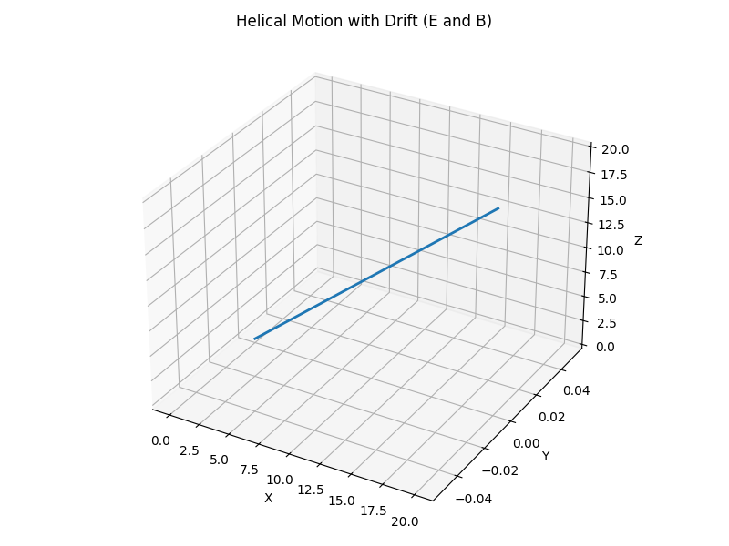
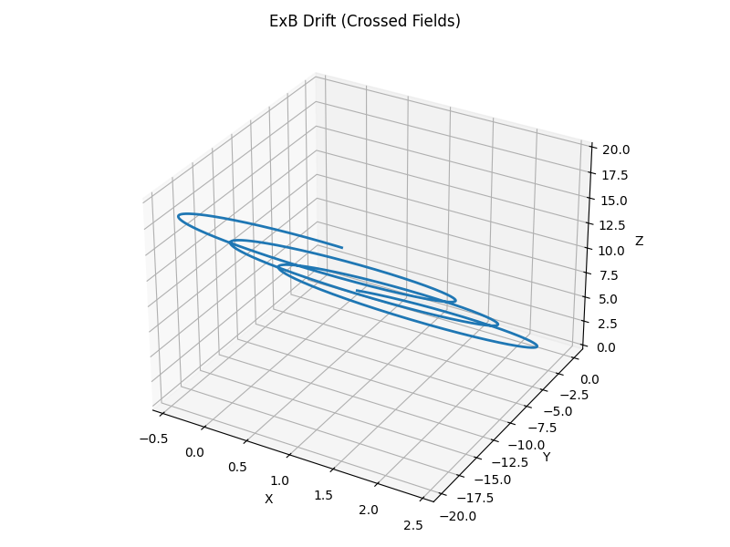

# Electromagnetism: Lorentz Force Simulation

## Problem 1 – Simulating the Effects of the Lorentz Force

### Motivation

The Lorentz force governs the motion of charged particles in electromagnetic fields and is given by:

$$
\vec{F} = q(\vec{E} + \vec{v} \times \vec{B})
$$

This force is fundamental to understanding plasma physics, mass spectrometry, particle accelerators, and astrophysical phenomena. Through simulations, we can explore the effects of different electric and magnetic field configurations on a particle's trajectory.

---

## 1. Exploration of Applications

- **Particle Accelerators**: Use magnetic fields to steer and focus particle beams.
- **Mass Spectrometers**: Separate ions by mass-to-charge ratio using electric and magnetic fields.
- **Plasma Confinement**: Magnetic fields contain high-temperature plasma in fusion reactors.
- **Cyclotrons**: Accelerate particles in spiral paths due to the Lorentz force.

Electric fields influence speed; magnetic fields influence direction. Together, they enable precision control of charged particles.

---

## 2. Simulation of Particle Motion



### Imports and Setup

<details>
<summary> Plots Codes </summary>

```python
import numpy as np
import matplotlib.pyplot as plt
from mpl_toolkits.mplot3d import Axes3D

# Constants and initial conditions
q = 1.0       # Charge (C)
m = 1.0       # Mass (kg)
dt = 0.01     # Time step (s)
steps = 2000  # Number of simulation steps

# Initial velocity and position
v0 = np.array([1.0, 0.0, 1.0])
r0 = np.array([0.0, 0.0, 0.0])
```

---

### Lorentz Force Function

```python
def lorentz_force(v, E, B):
    return q * (E + np.cross(v, B))
```

---

### Runge-Kutta 4 Integrator

```python
def rk4_lorentz(v0, r0, E, B):
    r = np.zeros((steps, 3))
    v = np.zeros((steps, 3))
    r[0] = r0
    v[0] = v0

    for i in range(steps - 1):
        k1v = dt * lorentz_force(v[i], E, B) / m
        k1r = dt * v[i]

        k2v = dt * lorentz_force(v[i] + 0.5 * k1v, E, B) / m
        k2r = dt * (v[i] + 0.5 * k1v)

        k3v = dt * lorentz_force(v[i] + 0.5 * k2v, E, B) / m
        k3r = dt * (v[i] + 0.5 * k2v)

        k4v = dt * lorentz_force(v[i] + k3v, E, B) / m
        k4r = dt * (v[i] + k3v)

        v[i+1] = v[i] + (k1v + 2*k2v + 2*k3v + k4v) / 6
        r[i+1] = r[i] + (k1r + 2*k2r + 2*k3r + k4r) / 6

    return r, v
```


---

### Field Configurations

```python
# Case 1: Uniform magnetic field (circular/spiral motion)
E1 = np.array([0.0, 0.0, 0.0])
B1 = np.array([0.0, 0.0, 1.0])

# Case 2: Uniform E and B fields (helical + drift)
E2 = np.array([0.0, 1.0, 0.0])
B2 = np.array([0.0, 0.0, 1.0])

# Case 3: Crossed E and B fields (ExB drift)
E3 = np.array([1.0, 0.0, 0.0])
B3 = np.array([0.0, 0.0, 1.0])
```

---

### Visualization

```python
def plot_trajectory(r, title="Trajectory"):
    fig = plt.figure(figsize=(10, 6))
    ax = fig.add_subplot(111, projection='3d')
    ax.plot(r[:, 0], r[:, 1], r[:, 2], lw=2)
    ax.set_title(title)
    ax.set_xlabel("X")
    ax.set_ylabel("Y")
    ax.set_zlabel("Z")
    plt.show()
```

---

### Run and Plot Simulations

```python
r1, _ = rk4_lorentz(v0, r0, E1, B1)
plot_trajectory(r1, "Circular/Helical Motion (B only)")

r2, _ = rk4_lorentz(v0, r0, E2, B2)
plot_trajectory(r2, "Helical Motion with Drift (E and B)")

r3, _ = rk4_lorentz(v0, r0, E3, B3)
plot_trajectory(r3, "ExB Drift (Crossed Fields)")
```
</details>

---

## 3. Parameter Exploration

Try modifying:
- $`q`$, $`m`$ : Charge and mass
- $`v0`$ : Initial velocity
- $`E`$, $`B`$ : Field vectors

Observe:
- **Larmor radius**: $ r_L = \frac{mv_\perp}{qB} $
- **Cyclotron frequency**: $ \omega_c = \frac{qB}{m} $
- **$E$ x $B$ drift velocity**: $ \vec{v}_d = \frac{\vec{E} \times \vec{B}}{B^2} $

---

## 4. Discussion and Applications

- **Cyclotrons** rely on the circular motion from a perpendicular $ \vec{v} $ and $ \vec{B}$.
- **Magnetic Traps** (e.g., tokamaks) confine particles using helical paths.
- **Mass Spectrometers** utilize radius dependence on mass-to-charge ratio.
- **Space Physics**: Charged particles spiral along magnetic field lines of Earth.

---

## 5. Extensions

- Include **non-uniform fields** (e.g., magnetic mirrors).
- Add **collisions or frictional forces**.
- Simulate multiple particles (plasmas, beam dynamics).

---

> **Note:** All simulations use the RK4 method for accuracy. Be sure to adjust `steps` and `dt` based on scenario dynamics.