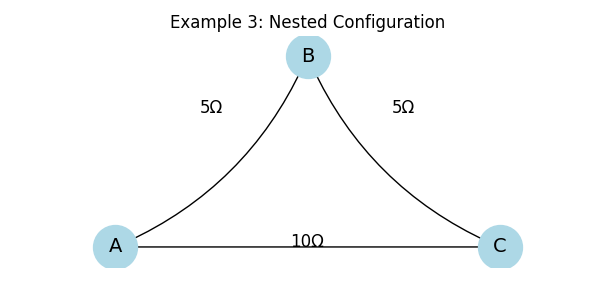

# Equivalent Resistance Using Graph Theory

## Problem Overview

Calculating the **equivalent resistance** in electrical circuits is essential for designing and analyzing efficient systems. While traditional methods work well for simple circuits, **graph theory** offers a powerful tool to handle **complex resistor networks**, especially with nested or looped configurations.

---

##  Motivation

- Traditional circuit analysis relies on identifying series and parallel components.
- This becomes difficult in large or irregular circuits.
- Graph theory provides a **systematic, programmable approach** using nodes ( junctions ) and edges ( resistors ).
- Enables **automation**, **visualization**, and **scalability**.

---

## Circuit as a Graph

- **Nodes** = electrical junctions
- **Edges** = resistors (with weight = resistance)
- Goal: Reduce graph to one equivalent edge between input and output nodes


---

## Algorithm Description

### Graph Simplification Strategy

1. **Detect series connections**: Nodes with degree 2 (except terminals)
2. **Detect parallel connections**: Multiple edges between same nodes or cycles
3. **Reduce step by step**:
   - Combine series: $( R_{eq} = R_1 + R_2 )$
   - Combine parallel: $( \frac{1}{R_{eq}} = \frac{1}{R_1} + \frac{1}{R_2} )$


   ## Examples & Visualizations

###  Example 1: Series Circuit

Two resistors are connected end-to-end:

- **A → B** : 10 $Ω$  
- **B → C** : 5 $Ω$

They are in **series**, so the equivalent resistance is:

$$
R_{\text{eq}} = R_1 + R_2 = 10\,\Omega + 5\,\Omega = 15\,\Omega
$$


###  Example 2: Parallel Circuit


Two resistors are connected between the same nodes **A** and **B**:

- **A ↔ B** : 10 $Ω$  
- **A ↔ B** : 20 $Ω$  

They are in **parallel**, so:

$$
\frac{1}{R_{\text{eq}}} = \frac{1}{10} + \frac{1}{20} = \frac{3}{20}
\quad\Rightarrow\quad
R_{\text{eq}} = \frac{20}{3} \approx 6.67\,\Omega
$$

###  Example 3: Nested Configuration


We have two paths from **A** to **C** :

- **Path 1** : A → B → C  
  - AB = 5 $Ω$, B C = 5 $Ω$ → total = 10 $Ω$  
- **Path 2** : Direct A → C = 10 $Ω$  

These two 10 $Ω$ paths are in **parallel**, so :

$$
\frac{1}{R_{\text{eq}}} = \frac{1}{10} + \frac{1}{10} = \frac{1}{5}
\quad\Rightarrow\quad
R_{\text{eq}} = 5\,\Omega
$$


### Pseudocode

```pseudo
function simplify_circuit(graph, input_node, output_node):
    repeat:
        for each node in graph:
            if node is not input/output and has degree 2:
                merge series resistors
        for each pair of nodes with parallel edges:
            combine using parallel rule
    until no more simplifications
    return resistance between input_node and output_node
