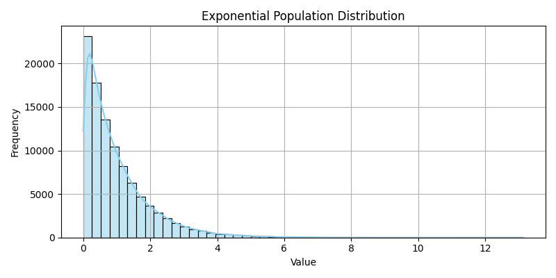
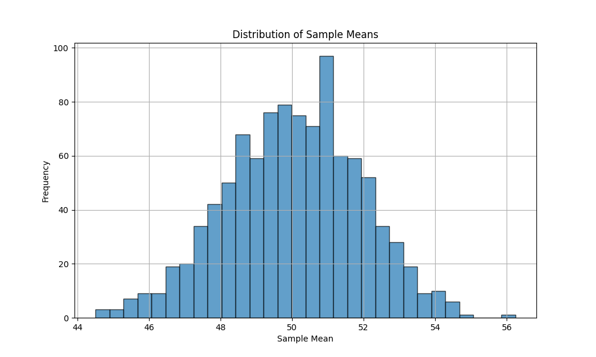

# Exploring the Central Limit Theorem (CLT) Through Simulations

##  Motivation
The **Central Limit Theorem (CLT)** is a key concept in statistics:

> Regardless of the population's distribution, the distribution of the sample mean becomes approximately normal as the sample size increases.

**Why is this important?**
- It justifies using the normal distribution in many real-world situations.
- Helps estimate population parameters.
- Essential in quality control, finance, and data analysis.

---

## Task 1 : Simulating Sampling Distributions

### Population Distributions:
We will use three types of populations:
- **Uniform**: Equal chance across a range.
- **Exponential**: Time between random events.
- **Binomial**: Count of successes over trials.

<details>
<summary>Python code</summary>

```python 

import numpy as np

def generate_population(dist, size=100000):
    if dist == "uniform":
        return np.random.uniform(0, 1, size)
    elif dist == "exponential":
        return np.random.exponential(scale=1.0, size=size)
    elif dist == "binomial":
        return np.random.binomial(n=10, p=0.5, size=size)
```

---
</details>



## Task 2 : Sampling and Visualization

### Sample and Calculate Sample Means:

<details>
<summary>Python code</summary>

```python
import numpy as np
import matplotlib.pyplot as plt

# Define the simulation function
def simulate_sampling(population, sample_size=30, n_samples=1000):
    return [
        np.mean(np.random.choice(population, size=sample_size, replace=False))
        for _ in range(n_samples)
    ]

# Create a population (e.g., a normal distribution)
population = np.random.normal(loc=50, scale=10, size=10000)

# Simulate the sampling process
sample_means = simulate_sampling(population, sample_size=30, n_samples=1000)

# Plot the distribution of sample means
plt.figure(figsize=(10, 6))
plt.hist(sample_means, bins=30, edgecolor='black', alpha=0.7)
plt.title('Distribution of Sample Means')
plt.xlabel('Sample Mean')
plt.ylabel('Frequency')
plt.grid(True)
plt.show()
```
</details>



### Visualize the Sampling Distributions:

<details>
<summary>Python code</summary>

```python
import matplotlib.pyplot as plt
import seaborn as sns

sns.set(style="whitegrid")

def plot_sampling_distribution(dist_name, population):
    sample_sizes = [5, 10, 30, 50]
    plt.figure(figsize=(16, 10))

    for i, size in enumerate(sample_sizes):
        sample_means = simulate_sampling(population, sample_size=size)
        plt.subplot(2, 2, i+1)
        sns.histplot(sample_means, bins=30, kde=True, color="skyblue")
        plt.title(f"{dist_name.capitalize()} Dist. - Sample Size {size}")
        plt.xlabel("Sample Mean")
        plt.ylabel("Frequency")

    plt.tight_layout()
    plt.suptitle(f"CLT Simulation for {dist_name.capitalize()} Population", fontsize=18, y=1.03)
    plt.show()
```

</details>

---

## Task 3 : Parameter Exploration

### Run Simulations:

<details>
<summary>Python code</summary>

```python
# Uniform
uniform_pop = generate_population("uniform")
plot_sampling_distribution("uniform", uniform_pop)

# Exponential
exp_pop = generate_population("exponential")
plot_sampling_distribution("exponential", exp_pop)

# Binomial
binom_pop = generate_population("binomial")
plot_sampling_distribution("binomial", binom_pop)
```
</details>


### Observations:
- Sample means tend toward normal shape.
- Variance of sample means decreases with sample size.
- Heavily skewed populations (e.g. exponential) require larger sample sizes.

---

## Task 4 : Practical Applications of CLT

- **Manufacturing**: Mean weight/size/quality of products.
- **Polling**: Estimating average opinions.
- **Finance**: Average return on investments.
- **Science**: Mean experimental measurements.

### Why It Works:
- Sample means are sums of random variables.
- Sums tend to normality via CLT.

---

## Conclusion

- The CLT enables the use of normal-based statistical methods.
- Useful even when the population is not normally distributed.
- Larger sample sizes lead to more accurate approximations.

> **Key Takeaway**: CLT bridges the gap between non-normal populations and the powerful tools of normal distribution analysis.

---

## Resources
- NumPy for random generation
- Matplotlib & Seaborn for plotting
- Recommended: Try with your own distributions

---

## Homework Suggestion
Try repeating the experiment using:
- A bimodal population
- A real-world dataset (e.g., heights, weights, test scores)

