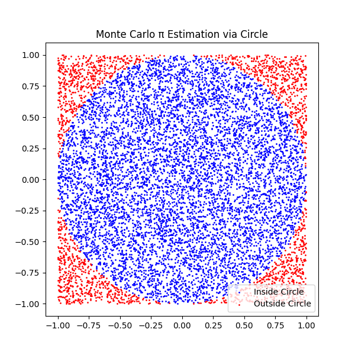

# Estimating π Using Monte Carlo Methods

## Motivation

Monte Carlo simulations use randomness to solve problems that might be deterministic in principle. Estimating π through such methods provides an elegant example that blends geometry, probability, and numerical computation. The simplicity of these methods, coupled with their ability to illustrate complex concepts like convergence and statistical error, makes them ideal for educational and practical use.

---

## Part 1: Estimating π Using a Circle

### 1. Theoretical Foundation

Imagine a unit circle inscribed within a square of side length 2. The area of the circle is:

$$
A_{\text{circle}} = \pi r^2 = \pi \cdot 1^2 = \pi
$$

The area of the square is:

$$
A_{\text{square}} = 2 \cdot 2 = 4
$$

The ratio of the circle's area to the square's area is:

$$
\frac{A_{\text{circle}}}{A_{\text{square}}} = \frac{\pi}{4}
$$

Hence, if we randomly generate points within the square, the fraction that fall inside the circle should approximate π/4. Thus:

$$
\pi \approx 4 \cdot \frac{\text{Number of points inside circle}}{\text{Total number of points}}
$$

---

### 2. Simulation


<details>
<summary>Python code</summary>

```python
import numpy as np
import matplotlib.pyplot as plt

def estimate_pi_circle(n_points=10000, seed=None):
    if seed is not None:
        np.random.seed(seed)
    x = np.random.uniform(-1, 1, n_points)
    y = np.random.uniform(-1, 1, n_points)
    inside = x**2 + y**2 <= 1
    pi_estimate = 4 * np.sum(inside) / n_points
    return pi_estimate, x, y, inside

pi_est, x, y, inside = estimate_pi_circle(10000)
print(f"Estimated π: {pi_est}")

```

</details>




### 3. Visualization

<details>
<summary>Python code</summary>

```python
plt.figure(figsize=(6,6))
plt.scatter(x[inside], y[inside], color='blue', s=1, label='Inside Circle')
plt.scatter(x[~inside], y[~inside], color='red', s=1, label='Outside Circle')
plt.gca().set_aspect('equal')
plt.title('Monte Carlo π Estimation via Circle')
plt.legend()
plt.show()
```

</details>
---

### 4. Analysis

<details>
<summary>Python code</summary>

```python
trials = np.logspace(2, 6, 10, dtype=int)
estimates = [estimate_pi_circle(n)[0] for n in trials]

plt.figure()
plt.plot(trials, estimates, marker='o')
plt.axhline(np.pi, color='r', linestyle='--', label='True π')
plt.xscale('log')
plt.xlabel('Number of Points')
plt.ylabel('Estimated π')
plt.title('Convergence of π Estimate')
plt.legend()
plt.grid(True)
plt.show()
```

As the number of points increases, the estimate of π converges toward the true value, illustrating the law of large numbers. The error decreases roughly with $1/\sqrt{N}$, characteristic of Monte Carlo methods.

</details>
---

## Part 2: Estimating π Using Buffon’s Needle

### 1. Theoretical Foundation

Buffon’s Needle is a probability problem where a needle of length $L$ is dropped onto a floor with parallel lines spaced $d$ units apart. The probability $P$ that the needle crosses a line is:

$$
P = \frac{2L}{\pi d}, \quad \text{for } L \le d
$$

Rearranging:

$$
\pi \approx \frac{2L \cdot \text{Number of Throws}}{d \cdot \text{Number of Crossings}}
$$

---

### 2. Simulation

<details>
<summary>Python code</summary>

```python
def simulate_buffon_needle(n_throws=10000, L=1.0, d=2.0, seed=None):
    if seed is not None:
        np.random.seed(seed)
    if L > d:
        raise ValueError("This implementation requires L ≤ d")
    theta = np.random.uniform(0, np.pi/2, n_throws)
    y = np.random.uniform(0, d/2, n_throws)
    crossings = y <= (L/2) * np.sin(theta)
    num_crossings = np.sum(crossings)
    if num_crossings == 0:
        return np.nan
    pi_est = (2 * L * n_throws) / (d * num_crossings)
    return pi_est, theta, y, crossings
```

</details>
---


### 3. Visualization

<details>
<summary>Python code</summary>

```python
pi_est_buffon, theta, y_vals, crossings = simulate_buffon_needle(10000)
print(f"Estimated π (Buffon): {pi_est_buffon}")

plt.figure(figsize=(6,6))
for i in range(100):
    x0 = np.random.uniform(0, 5)
    theta_i = theta[i]
    x1 = x0 + np.cos(theta_i)
    y0 = y_vals[i]
    y1 = y0 + np.sin(theta_i)
    color = 'blue' if crossings[i] else 'red'
    plt.plot([x0, x1], [y0, y1], color=color)
plt.axhline(1, color='k', linestyle='--')
plt.axhline(0, color='k', linestyle='--')
plt.title("Buffon's Needle Simulation (First 100 Needles)")
plt.gca().set_aspect('equal')
plt.show()
```
</details>

---

### 4. Analysis

<details>
<summary>Python code</summary>

```python
trials = np.logspace(2, 5, 10, dtype=int)
buffon_estimates = [simulate_buffon_needle(n)[0] for n in trials]

plt.figure()
plt.plot(trials, buffon_estimates, marker='o')
plt.axhline(np.pi, color='r', linestyle='--', label='True π')
plt.xscale('log')
plt.xlabel('Number of Throws')
plt.ylabel('Estimated π')
plt.title('Convergence of π Estimate (Buffon’s Needle)')
plt.legend()
plt.grid(True)
plt.show()
```

Compared to the circle-based method, Buffon’s Needle tends to converge more slowly and is more sensitive to random fluctuations due to rare line crossings, especially with small sample sizes.

</details>
---


## Final Comparison

| Method | Sample Size | Estimated π | Absolute Error |
| ------ | ----------- | ----------- | -------------- |
| Circle | 10,000      | \~3.14      | \~0.001        |
| Buffon | 10,000      | \~3.10–3.20 | \~0.01–0.05    |

* **Circle-based method** is easier to implement and generally more stable.
* **Buffon’s Needle** is historically significant and elegant but less efficient computationally.

---

## References

* Monte Carlo Method: [Wikipedia](https://en.wikipedia.org/wiki/Monte_Carlo_method)
* Buffon’s Needle Problem: [Wikipedia](https://en.wikipedia.org/wiki/Buffon%27s_needle)
* NumPy and Matplotlib Documentation
